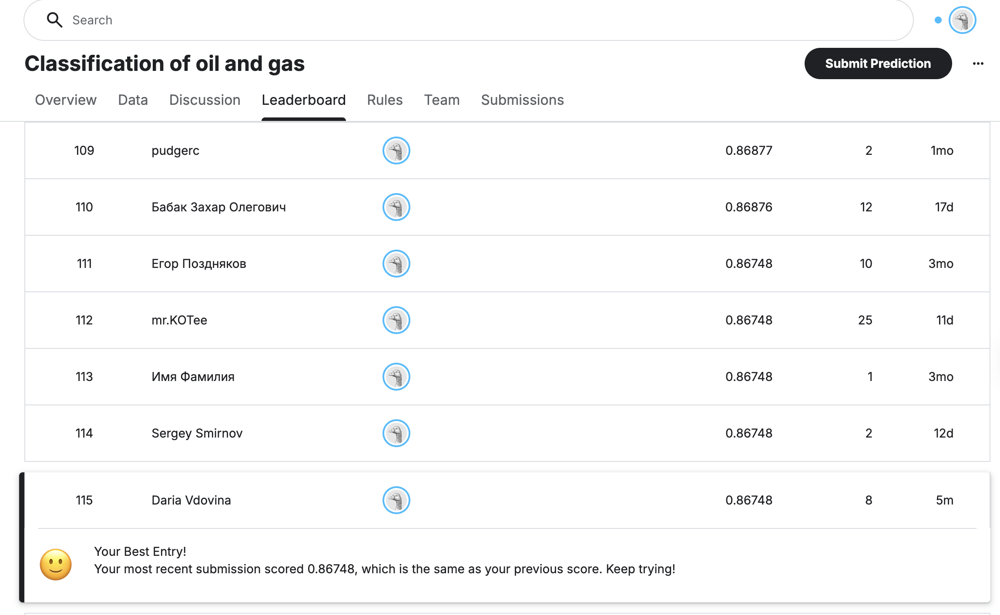

# Классификация мест залежей нефти и газа

Практическое задание "Классическое машинное обучение" в рамках обучения в магистратуре МИФИ.

## Описание задачи
Разработка алгоритма машинного обучения для бинарной классификации места залежей (суша или море) на основе геологических параметров. 

## Данные и соревнование
[Ссылка на соревнование Kaggle](https://www.kaggle.com/competitions/classification-of-oil-and-gas/overview)

## Технологический стек
* Python (Pandas, NumPy)
* Scikit-learn
* Matplotlib / Seaborn

## Результат на Kaggle

*Решение проверено преподавателем и признано воспроизводимым.*
